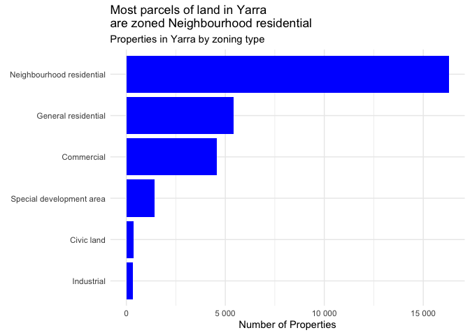

Victoria has [Mapshare](https://mapshare.vic.gov.au/vicplan/) and
[DigitalTwin](https://www.land.vic.gov.au/maps-and-spatial/digital-twin-victoria)
for looking at zoning and overlays for individual properties, but doing
policy analysis on these website can be challenging. Useful information
is dispersed across a multitude of files and a complex set of joins is
required to understand how planning laws are applied in Victoria.

Melbourne Dwellings data solves this problem by creating a single
dataset with one row for each piece of land in Melbourne. For each row
there is information about how many dwellings are currently on the land,
it’s zoning, overlays, heritage (including heritage register data),
distance to public transport, and proximity to polluting roads.

## What you can do with this data

The data makes it easy to understand how properties are zoned. For
instance, if we want to see how land in City of Yarra is zoned we can
download the CSV file and make a summary in just a few lines of code:

<!-- -->

# Get the data

If you just want the data you can download it
[here](https://drive.google.com/drive/folders/1wxzX66pj2BIfTIbev0Z7bVJcj1SomiZk?usp=sharing).

Your first step should be to download any of these files:

- “Melbourne dwelling data.gpkg” - A GeoPackage file, containing one row
  for each piece of land in Melbourne.
- “Melbourne dwelling data.csv” - A CSV file, containing one row for
  each piece of land in Melbourne.
- “Melbourne Dwelling Data geometry_only.shp” A shape file that contains
  the geometries that link to the csv file through id variables lat and
  lon

The files can be analysed in any GIS software such as ARCGIS, FELT, QGIS
etc. If you aren’t interested in maps, you can analyse the CSV files in
R, Python or any other statistical package.

# Understand the data

There is a [codebook available
here](https://htmlpreview.github.io/?https://github.com/jonathananolan/Melbourne-dwelling-map/blob/main/codebook.html)
which explains the meaning of every variable, including data quality
notes.

# Recreate the data yourself

Start by reading the file R/01how_to_run_code.R

# Add more information about each property

The code is designed to be modular, so you don’t need to re-run
everything in order to add your own useful information about a property
such as it’s vicplan PFI or property price data. Simply add a folder in
the /R folder and edit the 02.compile.R file to add it in.

# Other data sources

- The [Urban Development
  Program](https://www.planning.vic.gov.au/guides-and-resources/data-and-insights/urban-development-program)
  has data on each development since 2006. This repo has the most recent
  flow data from any project in the UDP from 2016 onwards, but a
  separate file is available from the UDP that has pre-2016 data.
- The [VBA](https://www.vba.vic.gov.au/about/data) releases building
  permit approvals at a street level.
- The [Valuer
  General](https://www.land.vic.gov.au/valuations/resources-and-reports/property-sales-statistics)
  has statistics about land values which includes dwelling type, but
  this data is sold to private providers and is only made available on
  request to academics or in a very summarised form.
- The state releases data on advertised
  [rents](https://github.com/yimbymelbourne/rental_report_cleaner) and
  house prices on a suburb level here
- The
  [ABS](https://www.abs.gov.au/statistics/industry/building-and-construction/estimated-dwelling-stock/latest-release)
  releases dwelling changes at a SA2 level.
- Each [census tablebuilder](https://tablebuilder.abs.gov.au/) product
  has dwelling counts that can be divided by the usual tablebuilder
  variables.
